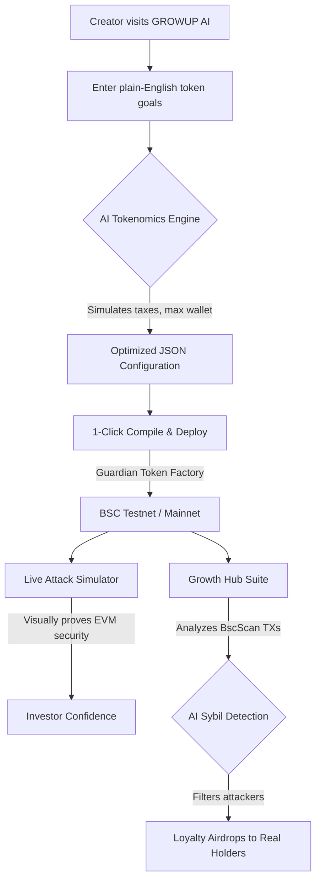

# GROWUP AI | End Token Crashes

- **Live Deployment:** [https://growupai.vercel.app/](https://growupai.vercel.app/)
- **Pitch Deck (Canva):** [View Presentation](https://www.canva.com/design/DAHClc3t0s8/BP34FUW6Rs7hvRNO0YuE6g/edit)
- **Demo Video (Drive):** [Watch Demo](https://drive.google.com/drive/folders/1KfU4vkpXRNttNHvrJKeiQKfKK3Jf6_hQ)

## The Vision
GROWUP AI is built to become the default intelligent layer for launching, securing, and scaling resilient token economies on the BNB Chain. We transition from a simple smart contract deployer into a comprehensive, AI-driven Web3 growth ecosystem, solving the most critical pain points that cause 95% of new token launches to fail.

---

## Key Project Highlights

- **A Complete, Functional Ecosystem on BNB:** We did not just build a UI mockup. GROWUP AI is a fully functional pipeline. Our platform actively queries LLaMa-3 (via Groq) to generate dynamic JSON tokenomics, translates those into EVM bytecode using our proprietary Guardian Smart Contract, and actually deploys it on the BSC Testnet.
- **The "Live Attack Simulator":** In Web3, security marketing is often "trust me bro." We built a dashboard that actively simulates MEV bot attacks and Whale dumps against the deployed token, displaying the exact *on-chain BSC revert reasons*. We prove our immutable EVM bytecode security directly to the user.
- **Solving Real BNB Ecosystem Pain Points:** The majority of newly launched tokens on BSC crash within 48 hours because creators lack the deep technical knowledge to implement Max Wallet limits, Sandwich Bot cooldowns, and dynamic taxes. By abstracting this complexity behind an AI zero-code interface, we constantly improve the liquidity retention, safety, and reputation of retail token launches on the BNB Chain.
- **The AI Sybil-Resistance Engine:** Our Airdrop/Growth module does not execute blind, exploitable distributions. It actively pulls live BscScan transaction histories and uses our AI engine to classify wallets—separating genuine "Diamond Hand" community members from 100-wallet Sybil farming rings—before executing the smart contract multi-send.

---

## Core Problems & Our Built Solutions

### 1. Complex and Vulnerable Token Deployments
**The Problem:** Launching a token typically requires deep Solidity expertise to ensure the contract is secure against exploits, minting bugs, and backdoors. Non-technical founders are forced to rely on expensive developers or copy-paste unverified code, leading to ecosystem-wide rug pulls and hacks.
**Our Built Solution:** We built a zero-code wizard that takes plain-English goals (e.g., "I want a community meme coin") and uses an AI agent (LLaMa-3 via Groq) to generate optimal, mathematically sound tokenomics. Our platform automatically compiles and deploys a verified, immutable `Guardian Token` smart contract directly to the BNB Chain. No coding required, zero risk of bad code.

### 2. Immediate Post-Launch Exploitation (Bots, Whales, Dumpers)
**The Problem:** The vast majority of newly launched tokens crash within 48 hours because they lack inherent economic defenses. MEV bots sandwich retail buyers, whales snipe the supply, and early buyers dump, instantly killing the project's momentum.
**Our Built Solution:** We hardcoded aggressive economic defenses directly into the EVM bytecode of the deployed token. Our `Guardian Token` contract natively enforces:
- **Max Wallet Limits:** Prevents whales from accumulating massive percentages of the supply.
- **Sell Cooldowns:** Blocks MEV sandwich bots by enforcing a strict time delay between buying and selling transactions from the same wallet.
- **Dynamic Sell Taxes:** Penalizes massive dumps by redirecting a percentage of the sell volume back to the project treasury or burn address.

### 3. Unverifiable Security Claims
**The Problem:** Many projects claim they feature "anti-whale" or "anti-bot" mechanisms on their marketing sites, but investors cannot verify if these protections actually exist or function on-chain until it is too late.
**Our Built Solution:** We built a first-of-its-kind "Live Attack Simulator." This interactive dashboard allows anyone to simulate live blockchain attacks (Whale accumulation, Bot sandwiching, Dump attacks, Unauthorized minting) against their deployed token. The UI executes real transactions on the BSC Testnet, displays the actual on-chain revert reasons, and provides direct BscScan transaction links. This categorically proves to investors that the security is enforced at the blockchain level, not simply simulated in the UI.

### 4. Ineffective, Sybil-Prone Incentive Programs
**The Problem:** Traditional airdrops are broken. They reward transient capital and Sybil farmers operating hundreds of interconnected wallets, draining the token's value without creating any long-term holder loyalty.
**Our Built Solution (Growth Suite):** We built an AI-powered Loyalty Airdrop engine. Our application pulls live BscScan transaction data for the token and feeds it into our AI models. The AI analyzes chronological holding patterns, buy-the-dip behaviors, and wallet funding sources to identify Sybil rings. It classifies wallets into tiers (e.g., Diamond Holders, Swing Traders, Sybil Attackers) and automatically executes a bulk, on-chain distribution only to genuine, high-value community members.

---

## User Journey Diagram



## Technical Architecture & Open-Source Dependencies

GROWUP AI leverages a modern, highly composable Web3 stack focused on the BNB Chain ecosystem.

### Frontend Application
- **Next.js 14 (App Router):** High-performance React framework for server-side rendering and routing.
- **Tailwind CSS & Framer Motion:** For highly responsive, cinematic, and accessible UI components.
- **Lucide React & Recharts:** For iconography and real-time dashboard data visualization.

### Blockchain & Web3 Integration
- **Viem & Wagmi:** State-of-the-art Ethereum/BSC typed interfaces for blockchain interaction, wallet connections, and contract execution.
- **Hardhat:** Specifically utilized for compiling our dynamically generated `Guardian Token` smart contracts directly within the deployment flow.
- **BscScan/Etherscan V2 API:** For pulling live, on-chain token transaction histories to feed the Growth Hub.

### AI Engine Ecosystem
- **Groq API & LLaMa-3 70B:** Unlocks near-instantaneous AI processing. Used for the tokenomics translation layer and the complex wallet behavior analysis (Sybil detection).

---

## 6-Month BNB Chain Roadmap

### Phase 1: Mainnet Readiness & Core Ecosystem Integration (Months 1-2)
- **BSC Mainnet Launch & Security Audits:** Complete rigorous smart contract audits for the Guardian Token factory and deploy our infrastructure from BSC Testnet directly to the BNB Smart Chain Mainnet.
- **PancakeSwap Native Integration:** Embed 1-click PancakeSwap liquidity provisioning (V2/V3) directly into our deployment flow. Creators will go from plain-English idea to active liquidity pool in minutes, entirely abstracting the complexity of LP setup.
- **BNB Greenfield Pilot:** Integrate BNB Greenfield to store immutable, decentralized records of our AI-generated tokenomic reports, deployment analytics, and Sybil-resistance lists, ensuring permanent transparency for investors.

### Phase 2: Advanced Network Defense & The "Growup Certified" Suite (Months 3-4)
- **Intelligent MEV Protection Layer:** Partner with BSC-native private RPCs to shield newly deployed tokens from malicious sandwich attacks and front-runners during the highly volatile first 48 hours of trading.
- **Live On-Chain Sybil Engine (V2):** Upgrade our Groq-powered AI airdrop analyzer to process live BSC Mainnet transaction graphs, identifying sophisticated multi-wallet farming rings and automatically isolating them from loyalty distribution smart contracts.
- **The "Growup Hub" Launchpad Directory:** Launch a public dashboard indexing all tokens generated via our platform. We will introduce a "Guardian Security Score" based on anti-dump protections, creating a trusted, curated environment for retail BNB investors.

### Phase 3: opBNB Scaling & Ecosystem Expansion (Months 5-6)
- **opBNB Layer 2 Expansion:** Bring the Growup AI deployer and Incentive Suite to opBNB. Capitalizing on opBNB's ultra-low gas fees, we will enable micro-reward programs, daily active user incentives, and high-frequency token distributions that are not economically viable on L1.
- **Autonomous DAO Treasury Modules:** Introduce AI-triggered smart contracts that monitor token health and autonomously execute strategic buybacks, periodic burns, or liquidity injections on PancakeSwap without requiring manual DAO voting for crisis management.
- **B2B Infrastructure API:** Package our "Live Attack Simulator" and AI Tokenomics Engine into an API suite. Other BNB Chain dApps, accelerators, and hackathons will be able to stress-test their own token models using our infrastructure before spending gas on deployment.

---

## Deployment & Local Installation Instructions

GROWUP AI is designed to be easily run locally for testing on the BSC Testnet.

### Prerequisites
- Node.js (v18 or higher)
- MetaMask Extension (configured with BSC Testnet and funded with test BNB via the official faucet)

### 1. Clone the Repository
```bash
git clone https://github.com/yourusername/growup-ai.git
cd growup-ai
```

### 2. Install Dependencies
```bash
npm install
```

### 3. Configure Environment Variables
Create a `.env.local` file in the root directory and add the following keys. (Note: These are required for the AI and on-chain analytics features to function).
```env
NEXT_PUBLIC_SUPABASE_URL=your_supabase_url
NEXT_PUBLIC_SUPABASE_ANON_KEY=your_supabase_anon_key
BSCSCAN_API_KEY=your_bscscan_or_etherscan_v2_key
GROQ_API_KEY=your_groq_api_key
```

### 4. Run the Development Server
```bash
npm run dev
```

### 5. Access the Platform
Open [http://localhost:3000](http://localhost:3000) in your browser. Ensure your MetaMask is connected to the BSC Testnet to interact with the deployment and simulator flows.

---
*GROWUP AI was built for the BNB Chain Hackathon, prioritizing security, automation, and real on-chain utility over hype.*
