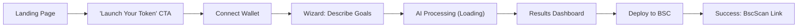
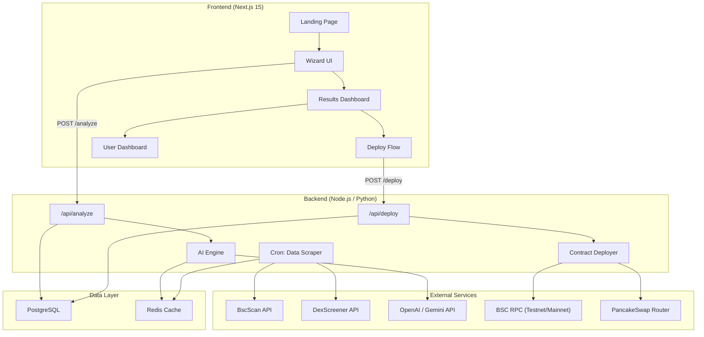
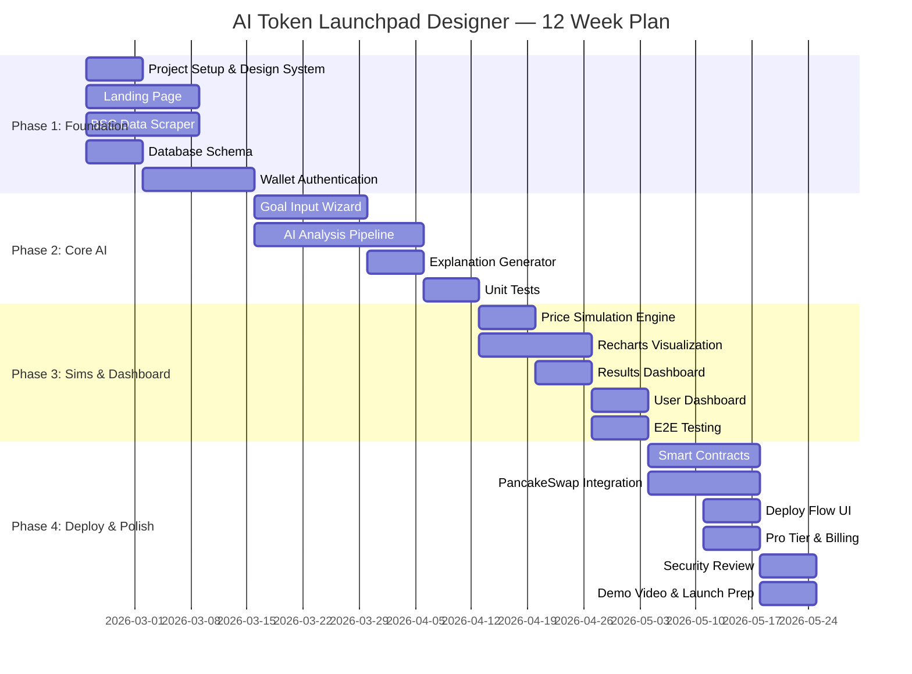

# Product Requirements Document (PRD)

## AI Token Launchpad Designer

---

> **Document Version:** 1.0  
> **Date:** February 17, 2026  
> **Author:** Product Team  
> **Status:** Draft  

---

## Slot Map (Reference)

```json
{
  "prd_instructions": "Build a web-based AI Token Launchpad Designer for BNB founders that generates crash-proof tokenomics configurations from user-defined goals, with price simulations, plain-English explanations, and 1-click BSC deployment.",
  "Product Overview": {
    "Project Title": "AI Token Launchpad Designer",
    "Version Number": "1.0",
    "Product Summary": "A goal-driven, AI-powered tokenomics configuration tool for BNB Chain founders. Users describe their launch goals in plain English; the platform analyzes 50+ successful BSC launches, generates an optimal token configuration (TGE unlock %, vesting schedule, distribution curve), visualizes 3 price simulation scenarios, explains every decision, and enables 1-click deployment to BSC — eliminating the 80-97% memecoin failure rate caused by guesswork."
  },
  "Goals": {
    "Business Goals": "Capture the underserved BNB tokenomics design market; monetize via freemium SaaS (free testnet, paid mainnet deploy + premium sims); establish data moat from historical BSC launch analytics.",
    "User Goals": "Go from a vague funding goal to a deployable, data-backed token config in under 5 minutes — no spreadsheets, no consultants, no guesswork.",
    "Non-Goals": "Full DEX aggregation; post-launch portfolio management; cross-chain deployment (ETH/SOL) in v1; legal/regulatory compliance advisory."
  },
  "User Personas": {
    "Key User Types": "BNB Founder (primary), Crypto Advisor/Consultant (secondary), DeFi Researcher (tertiary)",
    "Basic Persona Details": "See Section 3 below",
    "Role-Based Access": "Free Tier, Pro Tier, Admin"
  },
  "Functional Requirements": "See Section 4 below",
  "User Experience": {
    "Entry Points & First-time User Flow": "Landing page hero → 'Launch Your Token' CTA → Wizard (chat/form) → Results dashboard → Deploy",
    "Core Experience": "Goal input → AI analysis → Config + Simulations + Explanations → 1-Click Deploy",
    "Advanced Features & Edge Cases": "Custom vesting curves, multi-wallet distribution, anti-sniper delay tuning, saved launch templates",
    "UI/UX Highlights": "Wizard-style progressive disclosure, real-time Recharts simulations, glassmorphic dark-mode dashboard"
  },
  "Narrative": "See Section 6 below",
  "Success Metrics": {
    "User-Centric Metrics": "Time-to-config < 5 min; user satisfaction (NPS > 50); wizard completion rate > 70%",
    "Business Metrics": "1,000 configs generated in first 90 days; 5% free→paid conversion; $50k ARR by month 6",
    "Technical Metrics": "API p95 latency < 3s; deploy success rate > 99%; uptime 99.9%"
  },
  "Technical Considerations": {
    "Integration Points": "BscScan API, DexScreener API, OpenAI/Gemini API, wagmi/viem (wallet), PancakeSwap Router",
    "Data Storage & Privacy": "PostgreSQL (configs, users), Redis (data cache), no PII beyond wallet address, encrypted API keys",
    "Scalability & Performance": "Serverless API routes (Vercel), cron-cached BSC data (15-min refresh), rate-limited AI calls",
    "Potential Challenges": "BscScan API rate limits, LLM hallucination on tokenomics, gas estimation accuracy, PancakeSwap contract changes"
  },
  "Milestones & Sequencing": {
    "Project Estimate": "12 weeks",
    "Team Size & Composition": "1 Full-stack Dev, 1 AI/Backend Dev, 1 Smart Contract Dev, 1 Designer (part-time), 1 PM",
    "Suggested Phases": "See Section 9 below"
  },
  "User Stories": "See Section 10 below"
}
```

---

## 1. Product Overview

| Field | Detail |
|---|---|
| **Project Title** | AI Token Launchpad Designer |
| **Version** | 1.0 |
| **Platform** | Web (Desktop-first, responsive) |
| **Tech Stack** | Next.js 15, Shadcn/ui, Tailwind CSS, Recharts, Node.js, Python (analytics), wagmi/viem, ethers.js, OpenAI/Gemini API |

### Product Summary

The **AI Token Launchpad Designer** is a web-based platform that empowers BNB Chain founders to generate **crash-proof tokenomics configurations** from plain-English goals. Instead of spending 3+ weeks Googling TGE unlocks, guessing vesting cliffs in spreadsheets, and paying $10k consultants, founders describe what they want (e.g., *"Raise $50k, keep price stable for 30 days, add anti-sniper protection"*) and receive:

1. **An optimal JSON config** — TGE %, vesting schedule, distribution curve — derived from analysis of 50+ successful BSC launches.
2. **3 price simulation graphs** — Good (+50%), Normal, and Bad scenarios — powered by Recharts.
3. **Plain-English explanations** — *"10% TGE unlock is the sweet spot based on 47 successful BNB launches..."*
4. **1-Click BSC Deployment** — Wallet connect → mint ERC-20 token → deploy vesting contract → create PancakeSwap LP with anti-sniper delay.
5. **Full Launchpad Platform** — End-to-end token launch infrastructure: create, configure, fundraise, and list tokens on BSC.
6. **Progressive Liquidity Unlock (PLU)** — Smart contract-enforced gradual liquidity release tied to milestones, preventing rug pulls and building investor trust.
7. **AMM Customization** — Configure custom bonding curves, fee structures, and liquidity depth for PancakeSwap pairs.
8. **Post-Launch Growth Tools** — On-chain analytics dashboard, holder engagement metrics, automated buyback mechanisms, and community incentive programs.
9. **AI Token Templates Inspired by Modern AI** — Pre-built launch templates for AI-utility tokens (inspired by Claude, ChatGPT, and AI agent ecosystems), optimized for AI/chatbot project tokenomics.

> [!IMPORTANT]
> This product directly addresses the **80–97% memecoin failure rate** caused by poorly designed tokenomics. Existing tools (PinkSale, DxSale) offer only rigid dropdown presets with zero data analysis or simulation capability.

> [!CAUTION]
> Features 5–9 above are the **heart of this project**. They differentiate us from every existing launchpad and must be treated as top-priority (P0) deliverables.

### Current Landscape & Gap Analysis

| Tool | What It Does | What It Lacks |
|---|---|---|
| **PinkSale / DxSale** | Fixed-template launchpads, manual input | No AI, no data analysis, no simulations |
| **Four.meme** | BNB meme launcher | Exploited ($200k loss), no config intelligence |
| **Dune / TokenSniffer** | Post-launch analytics & audits | No pre-design capability |
| **TokenBench** | Basic token calculators | No BNB-specific data, no AI |
| **Consultants** | Custom tokenomics design | $10k+, weeks of turnaround |
| **Our Product** | **Goals → Data-backed config + simulations + 1-click deploy** | — |

---

## 2. Goals

### 2.1 Business Goals

- **BG-1:** Capture the underserved BNB tokenomics design market with an AI-first, data-driven approach.
- **BG-2:** Achieve **1,000 configurations generated** within the first 90 days of launch.
- **BG-3:** Establish a **freemium SaaS model** — free testnet deployments, paid mainnet deploys + premium simulations.
- **BG-4:** Build a **data moat** from historical BSC launch analytics that improves AI accuracy over time.
- **BG-5:** Reach **$50k ARR** by month 6 post-launch.
- **BG-6:** Achieve **5% free-to-paid conversion** rate.

### 2.2 User Goals

- **UG-1:** Go from a vague funding goal to a **deployable, data-backed token configuration in < 5 minutes**.
- **UG-2:** Understand *why* each tokenomics parameter was chosen through clear explanations.
- **UG-3:** Visualize potential price outcomes before committing capital.
- **UG-4:** Deploy to BSC with **zero Solidity knowledge** required.
- **UG-5:** Save and iterate on configurations across multiple launch ideas.

### 2.3 Non-Goals

- **NG-1:** Full DEX aggregation (PancakeSwap only in v1).
- ~~**NG-2:** Post-launch portfolio management or trading features.~~ *(Moved to core goals — see FR-11: Post-Launch Growth Tools)*
- **NG-3:** Cross-chain deployment (ETH, Solana, Polygon) — BNB Chain only in v1.
- **NG-4:** Legal or regulatory compliance advisory.
- **NG-5:** Mobile-native apps (responsive web only).
- **NG-6:** Custom smart contract auditing.

---

## 3. User Personas

### Persona 1: BNB Founder (Primary)

| Attribute | Detail |
|---|---|
| **Name** | Alex "DeFi Dreamer" |
| **Age** | 25–35 |
| **Occupation** | Indie crypto founder / side-project builder |
| **Tech Skill** | Intermediate — comfortable with MetaMask, basic DeFi, but no Solidity |
| **Pain Points** | Spent 3 weeks Googling tokenomics, used PinkSale presets, token crashed 80% in 48 hrs from whale dump |
| **Goal** | Launch a stable BNB token that raises $50k without price collapse |
| **Behavior** | Researches on Twitter/Telegram, follows BNB influencers, wants fast results |
| **Access Level** | Free Tier → Pro Tier (mainnet deploy) |

### Persona 2: Crypto Advisor / Consultant (Secondary)

| Attribute | Detail |
|---|---|
| **Name** | Sarah "TokenAdvisor" |
| **Age** | 30–45 |
| **Occupation** | Freelance crypto consultant |
| **Tech Skill** | Advanced — understands vesting, cliffs, LP mechanics |
| **Pain Points** | Manually builds Excel models for each client; no data-backed benchmarks |
| **Goal** | Generate professional configs for clients faster, with data backing |
| **Behavior** | Manages 5–10 client launches per quarter |
| **Access Level** | Pro Tier (batch configs, white-label reports) |

### Persona 3: DeFi Researcher (Tertiary)

| Attribute | Detail |
|---|---|
| **Name** | Marcus "DataNerd" |
| **Age** | 22–30 |
| **Occupation** | On-chain analyst / blogger |
| **Tech Skill** | Advanced |
| **Pain Points** | Wants to simulate "what-if" scenarios for articles/threads |
| **Goal** | Run simulations and export chart data for content creation |
| **Behavior** | Uses Dune dashboards, writes Twitter threads |
| **Access Level** | Free Tier (simulation-only mode) |

### Role-Based Access Matrix

| Feature | Free Tier | Pro Tier | Admin |
|---|---|---|---|
| Goal input & AI config generation | ✅ | ✅ | ✅ |
| 3 simulation graphs | ✅ | ✅ | ✅ |
| Explanations | ✅ | ✅ | ✅ |
| BSC Testnet deploy | ✅ | ✅ | ✅ |
| BSC Mainnet deploy | ❌ | ✅ | ✅ |
| Custom vesting curves | ❌ | ✅ | ✅ |
| Saved launch history | 3 max | Unlimited | Unlimited |
| Export config (JSON/PDF) | ❌ | ✅ | ✅ |
| White-label reports | ❌ | ✅ | ✅ |
| **Launchpad (create & fundraise)** | ✅ (testnet) | ✅ (mainnet) | ✅ |
| **Progressive Liquidity Unlock (PLU)** | Basic (linear) | Advanced (milestone-based) | ✅ |
| **AMM Customization** | ❌ | ✅ | ✅ |
| **Post-Launch Growth Dashboard** | Basic metrics | Full analytics + buyback | ✅ |
| **AI Token Templates** | ✅ | ✅ (premium templates) | ✅ |
| User management | ❌ | ❌ | ✅ |
| Analytics dashboard | ❌ | ❌ | ✅ |

---

## 4. Functional Requirements

### FR-1: Goal Input System

| ID | Requirement | Priority |
|---|---|---|
| FR-1.1 | Chat-style natural language input for describing launch goals | P0 |
| FR-1.2 | Structured form fallback (budget, stability period, anti-sniper toggle, reward %) | P0 |
| FR-1.3 | Input validation — reject non-tokenomics queries gracefully | P1 |
| FR-1.4 | Suggested goal templates (e.g., "Raise $50k, stable 30 days") | P1 |
| FR-1.5 | Support for follow-up refinement ("Make it more aggressive") | P2 |

### FR-2: AI Analysis Engine

| ID | Requirement | Priority |
|---|---|---|
| FR-2.1 | Scrape and cache data from 50+ successful BSC launches via BscScan & DexScreener APIs | P0 |
| FR-2.2 | Feed historical data + user goals to LLM (OpenAI/Gemini) with tokenomics-specific prompt | P0 |
| FR-2.3 | Output structured JSON config: `{ tge_unlock_pct, vesting_schedule, distribution_curve, anti_sniper_delay, lp_allocation }` | P0 |
| FR-2.4 | Pattern recognition: identify winning tokenomics patterns from historical data | P0 |
| FR-2.5 | Cron job to refresh BSC data cache every 15 minutes | P1 |
| FR-2.6 | Fallback to cached results if APIs are unavailable | P1 |

### FR-3: Simulation & Visualization

| ID | Requirement | Priority |
|---|---|---|
| FR-3.1 | Generate 3 price simulation scenarios — Good (+50%), Normal (stable), Bad (-30%) | P0 |
| FR-3.2 | Render interactive Recharts line graphs for each scenario | P0 |
| FR-3.3 | Show token distribution pie chart (team, public, LP, reserve) | P1 |
| FR-3.4 | Display vesting unlock timeline (bar chart) | P1 |
| FR-3.5 | Allow scenario parameter tweaking (drag sliders, regenerate) | P2 |

### FR-4: Explanation Engine

| ID | Requirement | Priority |
|---|---|---|
| FR-4.1 | Generate plain-English "Why this?" explanations for each config parameter | P0 |
| FR-4.2 | Reference specific historical launches as evidence (e.g., "Based on Token X which used 10% TGE...") | P1 |
| FR-4.3 | Expandable detail sections for advanced users | P1 |
| FR-4.4 | Tooltips on config table values with quick rationale | P2 |

### FR-5: 1-Click BSC Deployment

| ID | Requirement | Priority |
|---|---|---|
| FR-5.1 | Wallet connection via MetaMask (wagmi/viem) | P0 |
| FR-5.2 | Mint ERC-20 token using OpenZeppelin audited contract template | P0 |
| FR-5.3 | Deploy vesting contract with generated schedule | P0 |
| FR-5.4 | Create PancakeSwap LP with configurable anti-sniper delay | P0 |
| FR-5.5 | BSC Testnet deployment (free) | P0 |
| FR-5.6 | BSC Mainnet deployment (Pro Tier, paid) | P1 |
| FR-5.7 | Real-time deployment status with tx hash links to BscScan | P0 |
| FR-5.8 | Gas estimation before deployment confirmation | P1 |

### FR-6: User Dashboard

| ID | Requirement | Priority |
|---|---|---|
| FR-6.1 | View past configurations and simulations | P1 |
| FR-6.2 | Re-run simulations on saved configs | P1 |
| FR-6.3 | Track deployed token status (price, holders, LP depth) | P2 |
| FR-6.4 | Export config as JSON and PDF report | P2 |

### FR-7: Authentication & Account

| ID | Requirement | Priority |
|---|---|---|
| FR-7.1 | Wallet-based authentication (Sign-In with Ethereum/BNB) | P0 |
| FR-7.2 | Optional email for notifications | P2 |
| FR-7.3 | Tier management (Free / Pro) | P1 |

---

### FR-8: Launchpad Platform ⭐ CORE

> [!IMPORTANT]
> This is the **heart of the project**. The launchpad is the primary product surface — not just a deployment tool, but a full token launch platform.

| ID | Requirement | Priority |
|---|---|---|
| FR-8.1 | Token creation wizard — name, symbol, total supply, decimals, logo upload | P0 |
| FR-8.2 | Fundraise configuration — hardcap, softcap, min/max contribution per wallet, duration | P0 |
| FR-8.3 | Launchpad page (public) — countdown, progress bar, contribute button, participant count | P0 |
| FR-8.4 | Whitelist management — CSV upload, on-chain Merkle tree verification | P0 |
| FR-8.5 | Auto-listing on PancakeSwap after fundraise completes (LP creation + lock) | P0 |
| FR-8.6 | Refund mechanism if softcap not met within deadline | P0 |
| FR-8.7 | Launchpad discovery page — browse upcoming/active/completed launches | P1 |
| FR-8.8 | KYC-optional badge for verified project owners | P2 |

### FR-9: Progressive Liquidity Unlock (PLU) ⭐ CORE

> [!IMPORTANT]
> PLU is the flagship anti-rug mechanism. Liquidity is unlocked progressively based on time milestones or on-chain metrics — not all at once.

| ID | Requirement | Priority |
|---|---|---|
| FR-9.1 | Smart contract that locks LP tokens and releases them on a configurable schedule (e.g., 10% per month) | P0 |
| FR-9.2 | Milestone-based unlock triggers — price stability for N days, holder count thresholds, volume targets | P0 |
| FR-9.3 | Public PLU dashboard — shows locked amount, next unlock date, conditions met/unmet | P0 |
| FR-9.4 | Emergency lock extension — project owner can voluntarily extend lock (builds trust) | P1 |
| FR-9.5 | PLU verification badge — displayed on launchpad page when PLU is active | P0 |
| FR-9.6 | On-chain proof of lock — verifiable on BscScan, link provided to investors | P0 |
| FR-9.7 | AI-recommended PLU schedule — based on raise target and historical success data | P0 |

### FR-10: Automated Market Making (AMM) Customization ⭐ CORE

> [!IMPORTANT]
> Beyond just creating a PancakeSwap LP, founders can customize how their token trades — bonding curves, fee structures, and liquidity depth.

| ID | Requirement | Priority |
|---|---|---|
| FR-10.1 | Bonding curve selection — linear, exponential, sigmoid, or flat pricing curves | P0 |
| FR-10.2 | Visual bonding curve preview — interactive graph showing price vs. supply | P0 |
| FR-10.3 | Custom fee structure — configurable buy/sell tax (0–10%) with allocation split (LP, treasury, burn, holders) | P0 |
| FR-10.4 | Initial liquidity depth configuration — set starting price and BNB pairing amount | P0 |
| FR-10.5 | Anti-whale max transaction limit — configurable % of supply per transaction | P0 |
| FR-10.6 | Cooldown period between buys — prevent rapid accumulation | P1 |
| FR-10.7 | AI-recommended AMM settings — based on raise target and token category | P0 |
| FR-10.8 | Simulation of AMM behavior — preview how price reacts to buy/sell pressure with chosen curve | P1 |

### FR-11: Post-Launch Growth Tools ⭐ CORE

> [!IMPORTANT]
> The platform doesn't abandon founders after deployment. Post-launch tools drive retention, holder growth, and long-term token health.

| ID | Requirement | Priority |
|---|---|---|
| FR-11.1 | Live token dashboard — real-time price, market cap, holder count, LP depth, volume | P0 |
| FR-11.2 | Holder analytics — top holders, wallet distribution pie chart, new holders/day trend | P0 |
| FR-11.3 | Automated buyback mechanism — configurable treasury-funded buybacks triggered by price drops | P1 |
| FR-11.4 | Community incentive programs — airdrop scheduler, holder reward distribution | P1 |
| FR-11.5 | Token burn scheduler — configurable periodic burns from designated wallet | P1 |
| FR-11.6 | Social sentiment tracker — aggregate Twitter/Telegram mention volume (basic) | P2 |
| FR-11.7 | Growth alerts — notifications when holder count, volume, or price crosses thresholds | P1 |
| FR-11.8 | Comparative analytics — benchmark your token metrics against similar BSC launches | P2 |

### FR-12: AI Token Templates (Chatbot / AI Agent Inspired) ⭐ CORE

> [!IMPORTANT]
> A dedicated category of launch templates optimized for AI-utility tokens — the fastest-growing segment in crypto, inspired by projects like Claude, ChatGPT, and AI agent ecosystems.

| ID | Requirement | Priority |
|---|---|---|
| FR-12.1 | Pre-built AI token template library — utility tokens for AI chatbots, AI agents, compute networks, data marketplaces | P0 |
| FR-12.2 | AI-specific tokenomics presets — optimized TGE, vesting, and distribution for AI project categories | P0 |
| FR-12.3 | Usage-based token utility model — configurable pay-per-query / pay-per-compute token mechanics | P0 |
| FR-12.4 | Staking mechanism for AI service access — holders stake tokens to access AI services / priority queue | P1 |
| FR-12.5 | Revenue-sharing smart contract — protocol revenue distributed to token holders proportionally | P1 |
| FR-12.6 | AI project branding kit — logo generator, description templates, and pitch deck framework for AI token projects | P1 |
| FR-12.7 | Template gallery with live examples — showcase successful AI token launches as references | P0 |
| FR-12.8 | Custom AI agent integration — allow token holders to interact with project's AI agent directly from launchpad page | P2 |

---

## 5. User Experience

### 5.1 Entry Points & First-Time User Flow



1. **Landing Page** — Hero: *"End Token Crashes. Launch with AI-Backed Confidence."* + embedded demo video (3-min walkthrough) + social proof counters.
2. **CTA Click** → Wallet connect modal (MetaMask).
3. **Wizard Step 1** — Chat input or structured form: *"What are your launch goals?"*
4. **AI Loading** — Animated spinner with progress messages: *"Analyzing 50+ successful launches..."*, *"Optimizing your config..."*, *"Running simulations..."*
5. **Results Dashboard** — Config table + 3 simulation graphs + "Why this?" explanations + Deploy button.

### 5.2 Core Experience

The core loop is: **Describe → Analyze → Review → Deploy**

| Step | Screen | Key Interactions |
|---|---|---|
| 1. Describe | Wizard | Type goals in chat or fill form; pick template |
| 2. Analyze | Loading | Watch progress indicators; estimated time shown |
| 3. Review | Results Dashboard | Inspect config table, hover graphs, read explanations, tweak params |
| 4. Deploy | Deploy Modal | Confirm gas estimate, approve tx in MetaMask, track progress |

### 5.3 Advanced Features & Edge Cases

- **Custom Vesting Curves** (Pro): Draw custom unlock curves with drag-and-drop control points.
- **Multi-Wallet Distribution**: Allocate tokens to team/advisor/reserve wallets during deploy.
- **Anti-Sniper Tuning**: Slider for delay duration (30s – 5 min) with impact preview.
- **Edge: Wallet Disconnect** — Auto-save config to localStorage; resume after reconnect.
- **Edge: AI Timeout** — Show cached "safe default" config with disclaimer.
- **Edge: Insufficient Gas** — Clear error message with link to BNB faucet (testnet) or buy BNB guide.

### 5.4 UI/UX Highlights

- **Dark mode default** — Glassmorphic cards, vibrant gradient accents (BNB yellow → deep purple).
- **Wizard-style progressive disclosure** — One question at a time, no overwhelming forms.
- **Real-time graph updates** — Recharts animations as config changes.
- **Micro-animations** — Fade-in results, pulse on Deploy CTA, confetti on successful deploy.
- **Responsive** — Desktop-first, fully functional on tablet/mobile.
- **Accessibility** — ARIA labels, keyboard navigation, high-contrast mode toggle.

---

## 6. Narrative

### "Alex's First Launch"

> Alex, a 28-year-old indie crypto builder, has been dreaming about launching a community token on BNB Chain. Last time, he used PinkSale — picked "10% TGE" from a dropdown because it "sounded right," set a random 6-month vesting, and launched. Within 48 hours, a whale dumped 40% of circulating supply and the price cratered 85%. His community lost trust. His project died.
>
> This time, Alex finds the **AI Token Launchpad Designer**. He clicks "Launch Your Token," connects MetaMask, and types: *"I want to raise $50k, keep the price stable for at least 30 days, and protect against snipers."*
>
> In 12 seconds, the platform analyzes 50+ successful BNB launches with similar goals. It returns a config: **10% TGE unlock, 20%/month linear vesting, exponential distribution curve, 2-minute anti-sniper delay, 40% LP allocation.** Alex sees three price simulation graphs — the "Good" scenario shows +50% growth, "Normal" shows steady stability, and "Bad" shows only -15% (instead of -85%).
>
> Below the graphs, he reads: *"We recommend 10% TGE because 47 out of 50 successful launches in your budget range used 8-12% TGE. Higher unlocks correlated with 3x more whale dumps in the first 48 hours."*
>
> Alex clicks **Deploy**. His wallet prompts three transactions: mint token, deploy vesting, create PancakeSwap LP. Two minutes later, he has a live BSC testnet link. He shares it with his community on Telegram. Everyone can see the vesting schedule is locked and fair.
>
> Alex upgrades to Pro, deploys on mainnet, and 30 days later, his token is up 22%. No crashes. No whale dumps. Data-backed confidence.

---

## 7. Success Metrics

### 7.1 User-Centric Metrics

| Metric | Target | Measurement |
|---|---|---|
| Time from goal input to config output | < 15 seconds | Backend timer |
| Time from start to deployment (end-to-end) | < 5 minutes | Session analytics |
| Wizard completion rate | > 70% | Funnel tracking |
| User satisfaction (NPS) | > 50 | In-app survey (post-deploy) |
| Return usage (configs per user/month) | > 1.5 | User analytics |
| Explanation read rate | > 60% | Click/expand tracking |

### 7.2 Business Metrics

| Metric | Target | Timeline |
|---|---|---|
| Total configs generated | 1,000 | First 90 days |
| Free → Pro conversion | 5% | Ongoing |
| Annual Recurring Revenue (ARR) | $50,000 | Month 6 |
| Monthly Active Users (MAU) | 500 | Month 3 |
| Deploy-to-mainnet rate | 15% of all configs | Ongoing |
| Customer Acquisition Cost (CAC) | < $20 | Ongoing |

### 7.3 Technical Metrics

| Metric | Target | Measurement |
|---|---|---|
| API p95 latency (AI analysis) | < 3 seconds | Server monitoring |
| Deploy success rate | > 99% | Transaction tracking |
| Platform uptime | 99.9% | Uptime monitor |
| Data cache freshness | < 15 min stale | Cron job logs |
| AI accuracy (config quality score) | > 85% user approval | Post-generation feedback |

---

## 8. Technical Considerations

### 8.1 System Architecture



### 8.2 Integration Points

| Integration | Purpose | Protocol | Rate Limits |
|---|---|---|---|
| **BscScan API** | Fetch historical token launch data (contracts, holders, tx) | REST | 5 calls/sec (free key) |
| **DexScreener API** | Fetch price data, LP depth, volume for BSC tokens | REST | 300 calls/min |
| **OpenAI / Gemini API** | LLM for tokenomics analysis and explanation generation | REST | Tier-dependent |
| **wagmi / viem** | Wallet connection, transaction signing | Web3 | N/A (client-side) |
| **PancakeSwap Router V2** | Create LP pair, add liquidity | Smart Contract | Gas-dependent |
| **BSC RPC** | Deploy contracts, read chain state | JSON-RPC | Provider-dependent |

### 8.3 Data Storage & Privacy

- **PostgreSQL**: User accounts (wallet address, tier), saved configs, deploy history, feedback.
- **Redis**: Cached BSC launch data (15-min TTL), session data, rate-limit counters.
- **No PII collected** beyond wallet address (no email required for Free Tier).
- **API keys encrypted** at rest (AES-256) and accessed via environment variables.
- **GDPR-lite compliance**: Users can delete their account and all associated data.

### 8.4 Scalability & Performance

- **Serverless API routes** on Vercel for auto-scaling.
- **Cron-cached BSC data** reduces live API calls by 95%.
- **AI call queuing** with retry + exponential backoff for rate limit handling.
- **CDN-served frontend** for < 1s initial load.
- **Database connection pooling** via PgBouncer.

### 8.5 Potential Challenges & Mitigations

| Challenge | Risk | Mitigation |
|---|---|---|
| BscScan API rate limits | Data staleness | Aggressive caching (Redis, 15-min refresh), multiple API keys |
| LLM hallucination on tokenomics | Bad configs | Constrained output schema (JSON mode), validation layer, human-curated prompt templates |
| Gas estimation inaccuracy | Failed deploys | Add 20% gas buffer, pre-simulate with `eth_estimateGas` |
| PancakeSwap contract changes | Deploy failures | Pin to Router V2 address, monitor for upgrades, feature flag |
| Anti-sniper delay bypass | Exploits | Use battle-tested OpenZeppelin contracts, add max-tx-per-block limit |
| AI latency spikes | Poor UX | Show progressive loading states, stream partial results |

---

## 9. Milestones & Sequencing

### Project Estimate

**Total Duration:** 12 weeks

### Team Size & Composition

| Role | Allocation | Responsibilities |
|---|---|---|
| Full-Stack Developer | 100% | Frontend (Next.js, Recharts), API routes, wallet integration |
| AI / Backend Developer | 100% | LLM integration, data scraping pipeline, prompt engineering |
| Smart Contract Developer | 75% | Token & vesting contracts (OpenZeppelin), PancakeSwap integration |
| UI/UX Designer | 50% | Wizard flow, dashboard design, design system |
| Product Manager | 50% | Requirements, prioritization, user testing |

### Suggested Phases

#### Phase 1: Foundation (Weeks 1–3)

| Deliverable | Owner | Details |
|---|---|---|
| Project setup & design system | Designer + Full-Stack | Next.js 15, Shadcn/ui, Tailwind config, component library |
| Landing page | Full-Stack + Designer | Hero, demo video placeholder, CTA, responsive layout |
| BSC data scraper | AI/Backend | BscScan + DexScreener integration, Redis caching, cron job |
| Database schema | AI/Backend | PostgreSQL: users, configs, deploys tables |
| Wallet authentication | Full-Stack | wagmi/viem MetaMask connect, session management |

#### Phase 2: Core AI Engine (Weeks 4–6)

| Deliverable | Owner | Details |
|---|---|---|
| Goal input wizard | Full-Stack + Designer | Chat UI + structured form, input validation, templates |
| AI analysis pipeline | AI/Backend | LLM prompt engineering, historical data injection, JSON output parsing |
| Config output format | AI/Backend | Structured JSON schema: TGE %, vesting, curve, anti-sniper, LP |
| Explanation generator | AI/Backend | LLM-powered "Why this?" text with historical references |
| Unit tests for AI pipeline | AI/Backend | Mocked API responses, output validation, edge cases |

#### Phase 3: Simulations & Dashboard (Weeks 7–9)

| Deliverable | Owner | Details |
|---|---|---|
| Price simulation engine | AI/Backend | 3-scenario modelling (Good, Normal, Bad) based on config params |
| Recharts visualization | Full-Stack | Interactive line graphs, pie charts, vesting timeline bars |
| Results dashboard | Full-Stack + Designer | Config table, graphs, explanations, Deploy CTA |
| User dashboard | Full-Stack | Past configs, re-run sims, export (JSON/PDF) |
| End-to-end flow testing | QA/PM | Wizard → Analysis → Results → Deploy (testnet) |

#### Phase 4: Deployment & Polish (Weeks 10–12)

| Deliverable | Owner | Details |
|---|---|---|
| Smart contracts | Smart Contract Dev | ERC-20 mint (OpenZeppelin), vesting contract, anti-sniper module |
| PancakeSwap LP creation | Smart Contract Dev + Full-Stack | Router V2 integration, liquidity provisioning, delay config |
| Deploy flow UI | Full-Stack + Designer | Gas estimation, tx progress, BscScan link, error handling |
| BSC Testnet integration testing | All | Full deploy pipeline on testnet |
| Pro Tier & billing | Full-Stack | Stripe/crypto payment, feature gating, tier management |
| Security review | Smart Contract Dev | Contract audit checklist, re-entrancy checks, access controls |
| Demo video | PM + Designer | 3-min walkthrough: Input → AI → Deploy → BSC explorer |
| Launch preparation | PM | Documentation, landing page final, social assets |



---

## 10. User Stories

### US-001: Describe Launch Goals via Chat

| Field | Detail |
|---|---|
| **Title** | As a BNB founder, I want to describe my token launch goals in plain English, so that the AI understands my intent without technical jargon. |
| **Priority** | P0 |
| **Estimate** | 5 story points |

**Acceptance Criteria:**

- [ ] AC-1: User can type free-form text in a chat interface (min 10 chars, max 500 chars).
- [ ] AC-2: System shows suggested goal templates (e.g., "Raise $50k, stable 30 days, anti-sniper") as clickable chips.
- [ ] AC-3: Input is validated — non-tokenomics queries show a polite redirect message.
- [ ] AC-4: Chat supports follow-up messages to refine goals (multi-turn context).
- [ ] AC-5: Input is persisted to user session and recoverable on page refresh.

---

### US-002: Receive AI-Generated Tokenomics Config

| Field | Detail |
|---|---|
| **Title** | As a BNB founder, I want to receive an optimal tokenomics configuration generated by AI analysis of successful BSC launches, so that my token has a data-backed foundation. |
| **Priority** | P0 |
| **Estimate** | 8 story points |

**Acceptance Criteria:**

- [ ] AC-1: AI analyzes data from 50+ cached BSC launches relevant to user's goals.
- [ ] AC-2: Output is a structured JSON config with: `tge_unlock_pct`, `vesting_schedule`, `distribution_curve`, `anti_sniper_delay_sec`, `lp_allocation_pct`.
- [ ] AC-3: Config is displayed in a clean, readable table format.
- [ ] AC-4: Response time (goal input → config output) is under 15 seconds (p95).
- [ ] AC-5: If AI API is unavailable, system falls back to a cached "safe default" config with a warning banner.

---

### US-003: View Price Simulation Graphs

| Field | Detail |
|---|---|
| **Title** | As a BNB founder, I want to see 3 price simulation scenarios (Good, Normal, Bad) as interactive graphs, so that I can understand potential outcomes before deploying. |
| **Priority** | P0 |
| **Estimate** | 5 story points |

**Acceptance Criteria:**

- [ ] AC-1: Three Recharts line graphs are rendered: Good (+50%), Normal (stable), Bad (-30%).
- [ ] AC-2: Graphs show price trajectory over 30-day and 90-day time horizons (toggle).
- [ ] AC-3: Hovering a data point shows exact price and date in tooltip.
- [ ] AC-4: Graphs animate on load with a smooth fade-in.
- [ ] AC-5: Graphs are responsive and usable on mobile screens.

---

### US-004: Read Explanations for Config Choices

| Field | Detail |
|---|---|
| **Title** | As a BNB founder, I want plain-English explanations for each config parameter, so that I understand *why* my tokenomics are structured this way. |
| **Priority** | P0 |
| **Estimate** | 3 story points |

**Acceptance Criteria:**

- [ ] AC-1: Each config parameter has an associated "Why this?" explanation (≥ 2 sentences).
- [ ] AC-2: Explanations reference specific historical BSC launches as evidence when available.
- [ ] AC-3: Explanations are collapsible/expandable (collapsed by default on mobile).
- [ ] AC-4: Hover tooltips on config table values show a 1-line summary rationale.

---

### US-005: Deploy Token to BSC Testnet (1-Click)

| Field | Detail |
|---|---|
| **Title** | As a BNB founder, I want to deploy my configured token to BSC testnet with a single click, so that I can test my launch before going live. |
| **Priority** | P0 |
| **Estimate** | 8 story points |

**Acceptance Criteria:**

- [ ] AC-1: User clicks "Deploy to Testnet" button on the results dashboard.
- [ ] AC-2: System checks wallet is connected and on BSC Testnet network; prompts network switch if needed.
- [ ] AC-3: Gas estimation is shown before transaction approval.
- [ ] AC-4: Three transactions execute sequentially: (1) Mint ERC-20, (2) Deploy vesting contract, (3) Create PancakeSwap LP.
- [ ] AC-5: Real-time status updates for each transaction step (pending → confirmed → success).
- [ ] AC-6: On success, display BscScan explorer link to deployed token and LP.
- [ ] AC-7: On failure, display clear error message with retry option.

---

### US-006: Connect Wallet & Authenticate

| Field | Detail |
|---|---|
| **Title** | As a user, I want to connect my MetaMask wallet to authenticate, so that I can save configs and deploy tokens. |
| **Priority** | P0 |
| **Estimate** | 3 story points |

**Acceptance Criteria:**

- [ ] AC-1: "Connect Wallet" button is visible in header on all pages.
- [ ] AC-2: Clicking triggers MetaMask connection modal.
- [ ] AC-3: After connection, wallet address (truncated) is displayed in header.
- [ ] AC-4: Session persists across page refreshes (wagmi reconnect).
- [ ] AC-5: Disconnect option available in user menu dropdown.

---

### US-007: View Past Launch Configurations

| Field | Detail |
|---|---|
| **Title** | As a user, I want to view my past configurations and simulations in a dashboard, so that I can track and compare my launch ideas. |
| **Priority** | P1 |
| **Estimate** | 5 story points |

**Acceptance Criteria:**

- [ ] AC-1: Dashboard shows a list/grid of saved configs with: token name, date created, TGE %, status (draft/deployed).
- [ ] AC-2: Clicking a config opens the full results dashboard for that config.
- [ ] AC-3: User can re-run simulations on any saved config.
- [ ] AC-4: Free Tier users can save up to 3 configs; Pro Tier unlimited.
- [ ] AC-5: Delete option available for each config (with confirmation modal).

---

### US-008: Use Structured Form Input (Alternative to Chat)

| Field | Detail |
|---|---|
| **Title** | As a user who prefers structured input, I want to fill out a form with specific fields (budget, stability period, anti-sniper toggle), so that I can provide precise goals without free-form typing. |
| **Priority** | P1 |
| **Estimate** | 3 story points |

**Acceptance Criteria:**

- [ ] AC-1: Toggle to switch between "Chat" and "Form" input modes in the wizard.
- [ ] AC-2: Form includes fields: Budget target ($), Stability period (days), Anti-sniper protection (toggle), LP allocation % (slider), Vesting preference (dropdown).
- [ ] AC-3: Form validates inputs with inline error messages.
- [ ] AC-4: Form inputs produce the same quality AI output as chat input.
- [ ] AC-5: Form state is preserved when switching between chat and form modes.

---

### US-009: Deploy Token to BSC Mainnet (Pro)

| Field | Detail |
|---|---|
| **Title** | As a Pro Tier user, I want to deploy my configured token to BSC mainnet, so that I can go live with my token launch. |
| **Priority** | P1 |
| **Estimate** | 5 story points |

**Acceptance Criteria:**

- [ ] AC-1: "Deploy to Mainnet" button is visible only for Pro Tier users (grayed out with upgrade prompt for Free Tier).
- [ ] AC-2: Additional confirmation modal with: gas estimate (in BNB + USD), config summary, and "I understand this is irreversible" checkbox.
- [ ] AC-3: Deployment follows same 3-step process as testnet (mint, vesting, LP).
- [ ] AC-4: Success screen shows mainnet BscScan links and PancakeSwap trade link.
- [ ] AC-5: Deploy event logged with tx hashes in user dashboard.

---

### US-010: Export Config as JSON / PDF

| Field | Detail |
|---|---|
| **Title** | As a Pro Tier user, I want to export my token configuration as JSON and PDF, so that I can share it with advisors or my team. |
| **Priority** | P2 |
| **Estimate** | 3 story points |

**Acceptance Criteria:**

- [ ] AC-1: "Export" dropdown with JSON and PDF options on the results dashboard.
- [ ] AC-2: JSON export downloads a structured `.json` file with full config and metadata.
- [ ] AC-3: PDF export generates a branded report with config table, simulation graphs, and explanations.
- [ ] AC-4: Export features are gated to Pro Tier with upgrade prompt for Free users.

---

### US-011: Custom Vesting Curve Editor (Pro)

| Field | Detail |
|---|---|
| **Title** | As a Pro Tier user, I want to manually edit the vesting curve with drag-and-drop control points, so that I can fine-tune the unlock schedule beyond AI defaults. |
| **Priority** | P2 |
| **Estimate** | 5 story points |

**Acceptance Criteria:**

- [ ] AC-1: Interactive curve editor with draggable control points on the vesting timeline.
- [ ] AC-2: Simulations update in real-time as the curve changes.
- [ ] AC-3: "Reset to AI Default" button to revert custom changes.
- [ ] AC-4: Custom curves are validated (total unlock must equal 100%, minimum cliff period enforced).
- [ ] AC-5: Custom curve is saved with the config and deployable.

---

### US-012: View Landing Page & Demo

| Field | Detail |
|---|---|
| **Title** | As a first-time visitor, I want to see a compelling landing page with a demo video, so that I understand the product's value before signing up. |
| **Priority** | P1 |
| **Estimate** | 3 story points |

**Acceptance Criteria:**

- [ ] AC-1: Hero section with headline "End Token Crashes" and subheadline describing AI-backed tokenomics.
- [ ] AC-2: Embedded 3-minute demo video (Input → AI → Deploy → BSC explorer).
- [ ] AC-3: Social proof section: configs generated counter, deploy success rate, user testimonials.
- [ ] AC-4: Feature highlights grid with icons and descriptions.
- [ ] AC-5: Primary CTA "Launch Your Token" is above the fold and repeated at page bottom.
- [ ] AC-6: Page loads in < 2 seconds on 3G connection (Lighthouse score > 90).

---

### User Story Priority Summary

| Priority | Stories | Description |
|---|---|---|
| **P0** ⭐ | US-013, US-014, US-015, US-016, US-017 | **CORE**: Launchpad, PLU, AMM Customization, Post-Launch Growth, AI Token Templates |
| **P0** | US-001, US-002, US-003, US-004, US-005, US-006 | Core flow: Input → AI → Simulate → Explain → Deploy (Testnet) |
| **P1** | US-007, US-008, US-009, US-012 | Dashboard, form input, mainnet deploy, landing page |
| **P2** | US-010, US-011 | Export, custom curves |

---

### US-013: Create & Manage Token Launchpad ⭐ CORE

| Field | Detail |
|---|---|
| **Title** | As a BNB founder, I want to create a full launchpad for my token (fundraise page, whitelist, contribution tracking, auto-listing), so that I can run a professional token sale end-to-end. |
| **Priority** | P0 |
| **Estimate** | 13 story points |

**Acceptance Criteria:**

- [ ] AC-1: Launchpad creation wizard with: token name, supply, hardcap, softcap, min/max contribution, duration.
- [ ] AC-2: Public launchpad page with countdown timer, progress bar (raised vs. hardcap), participant count.
- [ ] AC-3: "Contribute" button triggers BNB transfer to launchpad contract via MetaMask.
- [ ] AC-4: Whitelist support — CSV upload or manual address entry, verified via Merkle proof on-chain.
- [ ] AC-5: Auto-listing: when hardcap is reached or timer ends (if softcap met), LP is created on PancakeSwap automatically.
- [ ] AC-6: Refund mechanism: if softcap not met by deadline, contributors can claim full refund.
- [ ] AC-7: Launchpad discovery page shows upcoming/active/completed launches with filter and search.

---

### US-014: Configure Progressive Liquidity Unlock (PLU) ⭐ CORE

| Field | Detail |
|---|---|
| **Title** | As a BNB founder, I want to set up Progressive Liquidity Unlock for my token, so that investors can verify my LP tokens are locked and released gradually — proving I'm not a rug pull. |
| **Priority** | P0 |
| **Estimate** | 8 story points |

**Acceptance Criteria:**

- [ ] AC-1: PLU configuration screen with: lock duration, unlock schedule (e.g., 10% monthly), and milestone triggers.
- [ ] AC-2: Milestone options include: price stability (N days above threshold), holder count target, volume target.
- [ ] AC-3: Public PLU dashboard visible to investors — shows locked amount, % unlocked, next unlock date/condition.
- [ ] AC-4: PLU verification badge displayed prominently on launchpad page.
- [ ] AC-5: On-chain proof — BscScan link to the lock contract, verifiable by anyone.
- [ ] AC-6: AI recommends optimal PLU schedule based on raise target and historical data.
- [ ] AC-7: Emergency lock extension — founder can voluntarily extend lock from dashboard (one-way, cannot shorten).

---

### US-015: Customize AMM Settings ⭐ CORE

| Field | Detail |
|---|---|
| **Title** | As a BNB founder, I want to customize how my token trades on PancakeSwap — bonding curves, fees, and liquidity depth — so that I can control price behavior and protect early investors. |
| **Priority** | P0 |
| **Estimate** | 8 story points |

**Acceptance Criteria:**

- [ ] AC-1: Bonding curve selector with visual preview: linear, exponential, sigmoid, flat.
- [ ] AC-2: Interactive graph shows price vs. supply for the selected curve.
- [ ] AC-3: Buy/sell tax configuration (0–10%) with allocation split: LP, treasury, burn, holder rewards.
- [ ] AC-4: Initial liquidity depth controls — set starting price and BNB pairing amount.
- [ ] AC-5: Anti-whale max transaction limit slider (% of total supply per tx).
- [ ] AC-6: AI-recommended AMM settings displayed with "Apply Recommended" button.
- [ ] AC-7: AMM behavior simulation — shows how price responds to sample buy/sell pressures.

---

### US-016: Access Post-Launch Growth Tools ⭐ CORE

| Field | Detail |
|---|---|
| **Title** | As a BNB founder who has deployed a token, I want a post-launch growth dashboard with analytics, buyback tools, and community incentives, so that I can grow my token's health and holder base over time. |
| **Priority** | P0 |
| **Estimate** | 8 story points |

**Acceptance Criteria:**

- [ ] AC-1: Live token dashboard — real-time price, market cap, holder count, LP depth, 24h volume.
- [ ] AC-2: Holder analytics — top 10 holders, wallet distribution chart, new holders/day trend.
- [ ] AC-3: Automated buyback configuration — set treasury wallet, trigger conditions (e.g., price drops 10%), buyback amount.
- [ ] AC-4: Airdrop scheduler — upload CSV of addresses, set distribution amount and date.
- [ ] AC-5: Token burn scheduler — configure periodic burns from designated wallet.
- [ ] AC-6: Growth alerts — set thresholds for holder count, volume, or price; receive notifications when crossed.
- [ ] AC-7: Comparative analytics — see how token metrics compare against similar BSC launches.

---

### US-017: Use AI Token Launch Templates ⭐ CORE

| Field | Detail |
|---|---|
| **Title** | As a founder building an AI/chatbot project, I want to use pre-built AI token templates with optimized tokenomics, so that I can launch an AI utility token with best-practice configurations. |
| **Priority** | P0 |
| **Estimate** | 5 story points |

**Acceptance Criteria:**

- [ ] AC-1: Template gallery with categories: AI Chatbot, AI Agent, Compute Network, Data Marketplace.
- [ ] AC-2: Each template includes: pre-set tokenomics (TGE, vesting, distribution), suggested utility model, and example projects.
- [ ] AC-3: Apply template with one click — auto-fills wizard with AI-optimized config.
- [ ] AC-4: Usage-based token utility model option — pay-per-query / pay-per-compute mechanics.
- [ ] AC-5: Staking configuration — holders stake to access AI services or priority queue.
- [ ] AC-6: Template details page shows live examples of successful AI token launches for reference.
- [ ] AC-7: AI branding kit — generate logo, description, and pitch deck framework for AI token project.

## Appendix A: Key Screens

### Screen 1: Landing / Home Page
- Hero banner with gradient background (BNB yellow → deep purple)
- Headline: *"End Token Crashes. Launch with AI-Backed Confidence."*
- Subheadline: *"From goals to deployment in 5 minutes. Powered by 50+ successful BSC launch patterns."*
- Embedded demo video
- Feature highlights (3-column grid): AI Config, Simulations, 1-Click Deploy
- Social proof counters
- CTA: "Launch Your Token" button (glassmorphic, pulsing)

### Screen 2: Wizard (Goals Input)
- Chat interface (left panel) with message bubbles
- Structured form toggle (right panel)
- Suggested goal templates as clickable chips
- Progress indicator (Step 1 of 3)
- Wallet connection status in header

### Screen 3: Results Dashboard
- **Top:** Config summary table (TGE %, vesting, curve, anti-sniper, LP allocation)
- **Middle:** 3 simulation graphs side-by-side (Recharts, interactive)
- **Bottom-left:** "Why this?" explanation cards (expandable)
- **Bottom-right:** Deploy CTA (Testnet / Mainnet toggle)
- Token distribution pie chart (sidebar)

### Screen 4: Deploy Flow
- Step progress: Mint → Vesting → LP → Success
- Gas estimation card
- Transaction status indicators (spinner → checkmark)
- BscScan link on success
- Confetti animation on completion

### Screen 5: User Dashboard
- Config cards grid (name, date, status badge)
- Quick actions: View, Re-simulate, Deploy, Delete
- Usage indicator (3/3 Free Tier or Unlimited Pro)
- Upgrade banner for Free Tier users

### Screen 6: Launchpad Page (Public) ⭐
- Token logo, name, and description header
- Fundraise progress bar (raised / hardcap) with BNB amount
- Countdown timer to launch end
- PLU verification badge (shield icon with green checkmark)
- "Contribute" button with min/max contribution display
- Participant count and average contribution
- Tokenomics breakdown (pie chart)
- PLU unlock schedule timeline

### Screen 7: AMM Customization Panel ⭐
- Bonding curve selector (4 visual curve thumbnails)
- Interactive price-vs-supply graph (Recharts)
- Tax config sliders (buy/sell, with allocation split preview)
- Anti-whale limit slider with impact preview
- "Apply AI Recommended" button with explanation

### Screen 8: Post-Launch Growth Dashboard ⭐
- Live metrics header: price, market cap, holders, volume (real-time)
- Holder distribution pie chart + top 10 holders table
- New holders/day trend line chart
- Buyback configuration card
- Airdrop/burn scheduler cards
- Growth alerts configuration

### Screen 9: AI Token Template Gallery ⭐
- Category filter tabs: All, Chatbot, Agent, Compute, Data
- Template cards with: icon, name, description, "Use Template" CTA
- Template detail view with pre-set tokenomics and live examples
- "Apply Template" fills wizard with one click

---

## Appendix B: Glossary

| Term | Definition |
|---|---|
| **TGE** | Token Generation Event — the initial release of tokens |
| **Vesting** | Scheduled release of tokens over time to prevent dumps |
| **Cliff** | Lockup period before any vesting tokens are released |
| **LP** | Liquidity Pool — paired tokens enabling trading on DEX |
| **Anti-Sniper** | Mechanism to prevent bots from buying at launch block |
| **BSC** | BNB Smart Chain (formerly Binance Smart Chain) |
| **DEX** | Decentralized Exchange (e.g., PancakeSwap) |
| **ERC-20** | Token standard (compatible on BSC as BEP-20) |
| **PLU** | Progressive Liquidity Unlock — gradual LP release tied to milestones |
| **AMM** | Automated Market Maker — algorithm-based trading (e.g., PancakeSwap) |
| **Bonding Curve** | Mathematical function defining token price relative to supply |
| **Buyback** | Using treasury funds to purchase tokens from market, reducing supply |
| **Hardcap** | Maximum amount that can be raised in a token sale |
| **Softcap** | Minimum amount that must be raised for a token sale to succeed |
| **Merkle Tree** | Cryptographic structure used for efficient whitelist verification |
| **AI Token** | Token designed to power AI/chatbot services (pay-per-query, staking) |

---

> **Document End — AI Token Launchpad Designer PRD v1.1**
